<div align="center">

```text
somil2113@github ~ $ cat contrib-heatmap.svg
```



<br/><br/>

```text
somil2113@github ~ $ neofetch && cat avi-ascii.svg
```

<table>
  <tr>
    <td valign="top">
      
    </td>
    <td valign="top">
      
    </td>
  </tr>
</table>

</div>

---

## Local setup

Save your portrait photo as `assets/source-photo.jpg`, then:

```bash
python3 -m venv .venv
source .venv/bin/activate
pip install -r scripts/requirements.txt

python scripts/prep_photo.py assets/source-photo.jpg --output source-prepped.png
python scripts/make_ascii_svg.py --input source-prepped.png --output avi-ascii.svg
python scripts/make_info_card.py
python scripts/fetch_contributions.py
python scripts/render_heatmap_svg.py
```

Optional: `STATIC=1` disables SVG animation. Override the GitHub user with `GITHUB_USERNAME`.

The daily workflow refreshes `data/contributions.json` and `contrib-heatmap.svg` automatically.
